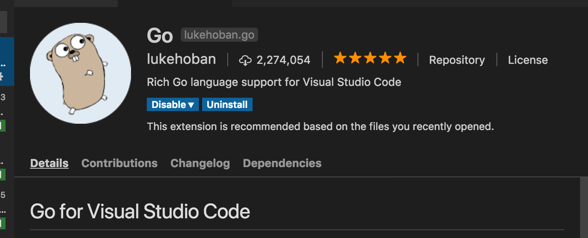
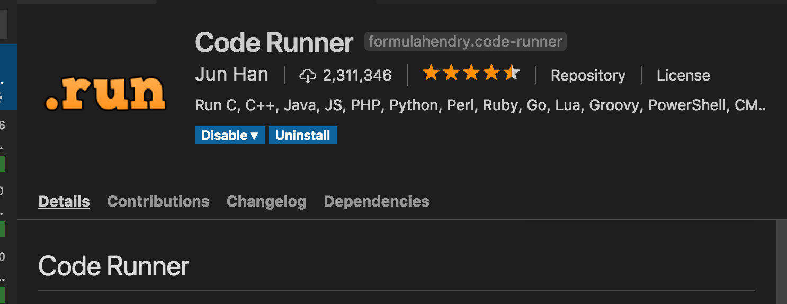

# Go Class 01 開發環境與語言簡介

寫 Go 建議用 Git 當 source control. 基本上，Go 相關的套件，絕大部分放在 Github 上。

資源：

1. 官網：[https://golang.org/](https://golang.org/)
1. 線上學習：[A tour of Go](https://tour.golang.org/welcome/1)。請務必要上網練習，玩過一輪後，差不多就學完最基本的語法，再撘配 [The Go Programming Language](https://www.amazon.com/Programming-Language-Addison-Wesley-Professional-Computing-ebook/dp/B0184N7WWS) 書，效果會比較好。
1. [Effective Go](https://golang.org/doc/effective_go.html): Go 上手後，一定要看。

Books:

1. [The Go Programming Language](https://www.amazon.com/Programming-Language-Addison-Wesley-Professional-Computing-ebook/dp/B0184N7WWS) [~中文版~](https://www.gitbook.com/book/wizardforcel/gopl-zh/details)
1. [Go Web Programming](https://www.manning.com/books/go-web-programming)
1. [Go System Programming](https://www.packtpub.com/networking-and-servers/go-systems-programming)

第一本看完就差不多了；第二本主要是講 Web，包含 DB, 版型；第三本主要是討論跟作業系統互動，對 routine, channel 有比較深入的說明。

## 環境設定

1. 下載 golang。[~下載連結~](https://golang.org/dl/)
1. 設定環境變數 **\$GOPATH**: `$GOPATH` 是專門放 Go 開發專案的目錄，所有 Go 相關的工具，也會一併裝在這個目錄。

## IDE 建議

建議用 Visual Studio Code，再安裝相關的 plugin。

1. Go plugin: [https://github.com/Microsoft/vscode-go](https://github.com/Microsoft/vscode-go)

    

1. Code Runner: [https://github.com/formulahendry/vscode-code-runner](https://github.com/formulahendry/vscode-code-runner)

    

## GOPATH 目錄說明

```text
.
├── bin
├── pkg
└── src
```

- bin: 主要放 Go 相關的工具程式，及專案的執行檔
- pkg: 編譯過程會產生的中間檔
- src: 放 source code.

### Soruce code 放法

1. 在 src 下，每個專案自己開一個目錄。自己有各自的 git repo。
1. 專案的主目錄下，每個 package 開一個目錄。
1. 一個目錄只能有一個 package。

## 語言特性

### 編譯式語言

- 與 PHP 直譯式不同，程式碼需要經過編譯成執行檔，才可以用。
- 與 Java 不同，直接編譯成 os 平台的 machine code。

### Strong Type

變數宣告後，它的資料型別也就固定了，不能再更改。不像 PHP 可以隨意改變變數的資料型別。

### 可在不同平台執行

與 Java 不同，需要重新 compile 成相對應的平台。

### 有 Garbage Collection

與 Java 類似，有 GC，可以不用自己管理記憶體，但也要注意，免得浪費記憶體還不知道。

### 沒有 OO (Object Oriented)

程式撰寫的觀念與 C 類似，有 pointer，但沒有物件導向[^nonOO]。

[^nonOO]: OOP 有三個基本特性: 封裝，繼承，多型。而 Go 只有封裝。因此我覺得 Go 不算是 OO 的語言。

### 有 package 管理

因此也會有變數 visible，如 public, private.

### Summary

- 寫 Go 與寫 C 類似，但有 GC，可以省去記憶體管理工作.
- 因為沒有 OO，只有封裝，沒有繼承等功能
- 沒有泛型 (Generic) 所以有關型別方面的寫作，就沒這個彈性。
- 有工具會自動校正 coding style.
- 檔案的編碼，一定要是 **UTF-8**。
- Function paramenter **pass by value** (call by value)