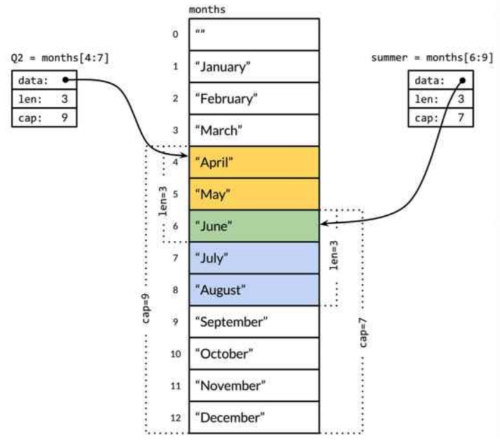

# 05 Data Types - Reference Types

- Pointer
- Slices
- Maps
- Functions
- Channel

## Pointer

- 與 C 相同，使用 `&` 來取得 pointer 位置，用 `*` 來存取 pointer 指定的值。
- 與 C 不同，不能直接對 pointer 做位移。

```go {.line-numbers}
a := 10
b := &a
*b = 20

fmt.Println(a)  // 20

arr := [3]int{0, 1, 2}

p := &arr
p++             // invalid operation: p++ (non-numeric type *[3]int)
fmt.Println(*p)
```

## Slices

Slice 與 Array 類似，與 Array 最大不同點是 Slice 的長度是可變動的，但 Array 是固定的。

Slice 組成元素：

- Pointer
- Length
- Capacity

Slice 的 zero value 是 **nil**

1. Slice Declaration

    `[]T` T 是指資料型別

    eg:

    ```go {.line-numbers}
    var s []int
    fmt.Println(s, s == nil, len(s), cap(s))    // [] true 0 0

    s = nil
    fmt.Println(s, s == nil, len(s), cap(s))    // [] true 0 0

    s = []int(nil)
    fmt.Println(s, s == nil, len(s), cap(s))    // [] true 0 0

    s = []int{}
    fmt.Println(s, s == nil, len(s), cap(s))    // [] false 0 0

    s = []int{1, 2, 3}
    fmt.Println(s, s == nil, len(s), cap(s))    // [1 2 3] false 3 3

    s = make([]int, 4)
    fmt.Println(s, s == nil, len(s), cap(s))    // [0 0 0 0] false 4 4

    s = make([]int, 5, 6)
    fmt.Println(s, s == nil, len(s), cap(s))    // [0 0 0 0 0] false 5 6
    ```

1. Array and Slice Relation

    實際上，Slice 底層還是 Array，Slice 的 pointer 會指定 array 的位置。

    ```go {.line-numbers}
    months := [...]string{1: "January", /* ... */, 12: "December"}
    Q2 := months[4:7]
    summer := months[6:9]
    fmt.Println(Q2)     // ["April" "May" "June"]
    fmt.Println(summer) // ["June" "July" "August"]
    ```

    

    - 記憶體處理

        由於 Array, Struct 都**不是** reference type，因此在傳入 function 時，都會 clone 一份新的資料，給 function 使用，也因此如果 array/struct 的資料很龐大時，就會造成記憶體上的浪費。因此在設計上，function 的參數有 array 時，請改用 slice, struct 請用 pointer。

        由於 slice 是用 pointer 指到 array, 因此修改 slice 的值時，也會異動到原本的 array.

        eg:

        ```go {.line-numbers}
        package main

        import "fmt"

        func plus(s []int) {
            for i, x := range s {
                s[i] = x + 1
            }
        }

        func main() {

            s := [6]int{0, 1, 2, 3, 4, 5}

            s1 := s[2:]

            plus(s1)

            fmt.Println(s)  // [0 1 3 4 5 6]
        }
        ```

1. Slice Append

    可以使用 `append` 新增資料進 slice

    ```go {.line-numbers}
    s := [6]int{0, 1, 2, 3, 4, 5}

    s1 := s[2:]
    fmt.Println(len(s1), cap(s1))   // 4 4

    s1 = append(s1, 100)

    fmt.Println(s)  // [0 1 2 3 4 5]
    fmt.Println(s1) // [2 3 4 5 100]

    s2 := s[1:3]
    fmt.Println(len(s2), cap(s2))   // 2 5

    s2 = append(s2, 30)

    fmt.Println(s)  // [0 1 2 30 4 5]
    fmt.Println(s2) // [1 2 30]
    ```

    **注意**: 上述範例中，`s1` 已經沒有空間做 `append`，因此產生了一組新的記憶體空間，也因為這樣，才沒有更動到 `s`。但 `s2` 還有空間做 `append`, 可以用原來的位址來操作，因此會修改到原來的 `s`。[^append]

    在實作上，儘可能利用 **slice** 而非 array。

    1. 可避免因 pass by value，而造成記憶體的泿費
    1. 避免上述 puzzle.

    [^append]: 在進行 append 時，會先檢查 capacity 是否有足夠空間，來加入新的資料，如果沒有時，則會再產生一組新的記憶體空間，先將舊的資料，**copy** 進新的空間，再把新的資料加入。也因此，如果要大量 append 資料時，應該先計算好可能的容量大小，以免一直在做 copy 的動作，影響效能。

1. Slice Travel
    與 array 同，用 `for-range`

## Maps

Key-Value 結構，也就是 hashtable 的結構。

1. Map Declaration

    ```go {.line-numbers}
    ages := map[string]int{
        "alice":   31,
        "charlie": 34,
    }
    ```

    也可使用 `make` 來產生 空白 map.

    ```go {.line-numbers}
    ages := make(map[string]int) // mapping from strings to ints
    ```

1. Put

    ```go {.line-numbers}
    ages["alice"] = 32      // alice = 32
    ages["alice"]++         // alice = 33
    ```

1. Delete

    ```go {.line-numbers}
    delete(ages, "cat")
    ```

1. Get

    Map 在取值時，如果 key 不存在，會回值 value 型別的 **zero value**，也因此無法直接從回傳值來判斷該 key 是否存在。可以利用 `value, ok := map[key]` 的方式，透過驗証 `ok` 來判斷 key 是否存在。

    ```go {.line-numbers}
    ages := map[string]int{
        "alice":   31,
        "charlie": 34,
    }

    fmt.Println(ages["bob"])    // 0 (zero-value)

    a, ok := ages["bob"]
    fmt.Println(a, ok)          // 0, false
    ```

1. Map Travel

    與 array 同，用 `for-range`

    ```go {.line-numbers}
    for name, age := range ages {
        fmt.Printf("%s\t%d\n", name, age)
    }
    ```