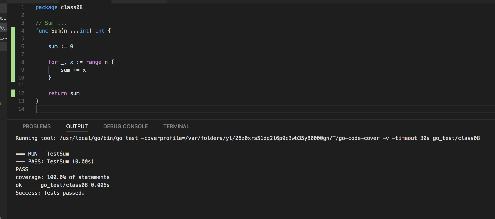

# 09 Testing

Go 有自帶一個 Unit Test 的工具包。程式寫作時，可以自動做 unit test。使用上的慣例：在當下的目錄下，為每一個程式檔案，再新增一個 xxx_test.go 的檔案，裏面撰寫 unit test 程式。

VSCode Go Plugins 設定：

```json
{
    "terminal.integrated.shell.osx": "/bin/zsh",
    "go.coverOnSave": true,
    "go.coverageDecorator": "gutter"
}
```

eg: 專案目錄是 `class10`

```text
.
├── util.go
└── util_test.go
```

測試 function 命名是以 **Test** 開頭，通常會針對要測試的 function 來命名，比如：有一個 `Sum` 的 function, 測試 `Sum` 的 function 則命名為 `TestSum`。

eg:

util.go

```go { .line-numbers }
package class10

// Sum ...
func Sum(n ...int) int {

    sum := 0

    for _, x := range n {
        sum += x
    }

    return sum
}
```

util_test.go

```go { .line-numbers }
package class10

import "testing"

func TestSum(t *testing.T) {

    x := Sum(1, 2, 3, 4, 5)

    if x != 15 {
        t.Fatal("sum error")
    }
}
```

如果 VSCode 有設定正確的話，在每次修改 util.go 存檔後，會自動執行 unit test，並回報覆蓋度。如下圖：



## tesint.T

`testing.T` 是做 unit test 會帶入的參數，它的功能很多 (可參考[官方說明](https://golang.org/pkg/testing/#T))，以下列出常用的 function。

1. Log, Logf: 輸出訊息
1. Fail: 標註目前測試，發生錯誤，但**繼續**執行
1. FailNow: 標註目前測試，發生錯誤，**中斷**執行
1. Error, Errorf: Log + Fail
1. Fatal, Fatalf: Log + FailNow

通常會用到的是 `Log`, `Logf`, `Error`, `Errorf`, `Fatal`, `Fatalf`

## testing.M

很多情況下，unit test 會需要先產生測試資料，在完成後，刪除測試資料。此時，撰寫 unit test 就好像在寫一個完整的執行程式，此時就會用到 `testing.M`.

eg:

```go { .line-numbers }
package class10

import (
    "os"
    "testing"
)

func TestSum(t *testing.T) {

    x := Sum(1, 2, 3, 4, 5)

    if x != 15 {
        t.Fatal("sum error")
    }
}

func TestMain(m *testing.M) {
    // initialize test resource

    exitCode := m.Run()

    // destroy test resource

    os.Exit(exitCode)
}
```

## Benchmark

Go Unit Test 套件，也可以做 benchmark 測試，程式碼撰寫在 `xxx_test.go` 中，function 命名與 Test 類似，以 **Benchmark** 開頭。

eg:

```go { .line-numbers }
package class10

import (
    "os"
    "testing"
)

func TestSum(t *testing.T) {

    x := Sum(1, 2, 3, 4, 5)

    if x != 15 {
        t.Fatal("sum error")
    }
}

func TestMain(m *testing.M) {
    // initialize test resource

    exitCode := m.Run()

    // destroy test resource

    os.Exit(exitCode)
}

func BenchmarkSum(b *testing.B) {
    for i := 0; i < b.N; i++ {
        Sum(1, 2, 3, 4, 5, 6, 7, 8, 9, 10)
    }
}
```

VS Code 預設不會執行 benchmark，因此可以在 console 下，切換到專案目錄，執行 `go test -bench="."`。可以得到以下的結果：

```text
goos: darwin
goarch: amd64
pkg: go_test/class10
BenchmarkSum-4
200000000                8.01 ns/op
PASS
ok      go_test/class10 2.421s
```

以中 `200000000                8.01 ns/op` 是指本次 benchmark 執行 **200000000** 次數，**8.01 ns/op** 每次花費 **8.01 ns**。
1 ns/op** 每次花費 **8.01 ns**。
