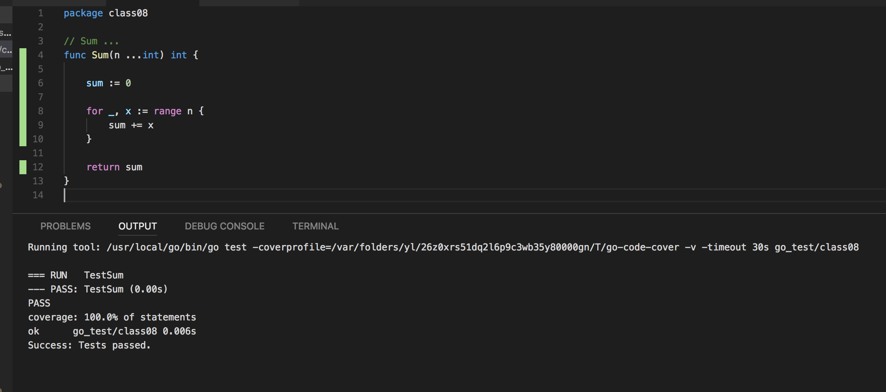

# 09 Testing
  
  
Go 有自帶一個 Unit Test 的工具包。程式寫作時，可以自動做 unit test。使用上的慣例：在當下的目錄下，為每一個程式檔案，再新增一個 xxx_test.go 的檔案，裏面撰寫 unit test 程式。
  
VSCode Go Plugins 設定：
  
```json
{
    "terminal.integrated.shell.osx": "/bin/zsh",
    "go.coverOnSave": true,
    "go.coverageDecorator": "gutter",
    "go.testFlags": ["-v"]
}
```
  
eg: 專案目錄是 `class09`
  
```text
.
├── util.go
└── util_test.go
```
  
測試 function 命名是以 **Test** 開頭，通常會針對要測試的 function 來命名，比如：有一個 `Sum` 的 function, 測試 `Sum` 的 function 則命名為 `TestSum`。
  
util.go
  
```go
package class09
  
import "fmt"
  
func init() {
    fmt.Println("class09 init")
}
  
const (
    defaultSum = 0  // package class09_test 無法存取
)
  
// Sum ...
func Sum(x ...int) int {
    s := 0
  
    for _, v := range x {
        s += v
    }
  
    return s
}
```
  
util_test.go
  
```go
package class09_test
  
import (
    "fmt"
    "os"
    "testing"
  
    . "go_test/class09"
)
  
func TestSum(t *testing.T) {
  
    x := Sum(1, 2, 3, 4, 5)
  
    if x != 15 {
        t.Fatal("sum error")
    }
}
  
func TestMain(m *testing.M) {
    // initialize test resource
  
    exitCode := m.Run()
  
    // destroy test resource
  
    os.Exit(exitCode)
}
  
func BenchmarkSum(b *testing.B) {
    for i := 0; i < b.N; i++ {
        Sum(1, 2, 3, 4, 5, 6, 7, 8, 9, 10)
    }
}
  
func ExampleSum() {
    fmt.Println("hello world")
  
    fmt.Println(Sum(1, 2, 3))
    // Output:
    // hello world
    // 6
}
  
func ExampleHello() {
    fmt.Println("hello world")
  
    fmt.Println(Sum(1, 2, 3))
    // Unordered output:
    // 6
    // hello world
}
```
  
如果 VSCode 有設定正確的話，在每次修改 util.go 存檔後，會自動執行 unit test，並回報覆蓋度。如下圖：
  

  
## tesint.T
  
  
`testing.T` 是做 unit test 會帶入的參數，它的功能很多 (可參考[官方說明](https://golang.org/pkg/testing/#T ))，以下列出常用的 function。
  
1. Log, Logf: 輸出訊息
1. Fail: 標註目前測試，發生錯誤，但**繼續**執行
1. FailNow: 標註目前測試，發生錯誤，**中斷**執行
1. Error, Errorf: Log + Fail
1. Fatal, Fatalf: Log + FailNow
  
通常會用到的是 `Log`, `Logf`, `Error`, `Errorf`, `Fatal`, `Fatalf`
  
## testing.M
  
  
很多情況下，unit test 會需要先產生測試資料，在完成後，刪除測試資料。此時，撰寫 unit test 就好像在寫一個完整的執行程式，此時就會用到 `testing.M`.
  
eg:
  
```go
func TestSum(t *testing.T) {
  
    x := Sum(1, 2, 3, 4, 5)
  
    if x != 15 {
        t.Fatal("sum error")
    }
}
  
func TestMain(m *testing.M) {
    // initialize test resource
  
    exitCode := m.Run()
  
    // destroy test resource
  
    os.Exit(exitCode)
}
```
  
## Benchmark
  
  
Go Unit Test 套件，也可以做 benchmark 測試，程式碼撰寫在 `xxx_test.go` 中，function 命名與 Test 類似，以 **Benchmark** 開頭。
  
eg:
  
```go
func BenchmarkSum(b *testing.B) {
    for i := 0; i < b.N; i++ {
        Sum(1, 2, 3, 4, 5, 6, 7, 8, 9, 10)
    }
}
```
  
VS Code 預設不會執行 benchmark，因此可以在 console 下，切換到專案目錄，執行 `go test -bench="."`。可以得到以下的結果：
  
```text
goos: darwin
goarch: amd64
pkg: go_test/class10
BenchmarkSum-4
200000000                8.01 ns/op
PASS
ok      go_test/class10 2.421s
```
  
以中 `200000000                8.01 ns/op` 是指本次 benchmark 執行 **200000000** 次數，**8.01 ns/op** 每次花費 **8.01 ns**。
1 ns/op** 每次花費 **8.01 ns**。
  
## Example
  
  
**Example** 開頭的 function 也可用來測試程式，主要是比對輸出是否正確。在程式碼中，需加入一段**註解**來說明該程式正確的輸出結果為何？
  
- // Output: 比對輸出結果，且順序都要一致。
- // Unordered Output: 比對輸出結果，但順序可以不同。
  
eg:
  
```go
func ExampleSum() {
    fmt.Println("hello world")
  
    fmt.Println(Sum(1, 2, 3))
    // Output:
    // hello world
    // 6
}
  
func ExampleHello() {
    fmt.Println("hello world")
  
    fmt.Println(Sum(1, 2, 3))
    // Unordered output:
    // 6
    // hello world
}
```
  
## Package 命名
  
  
在上例中，`class09` 目錄下，有兩個 packages: `class09` 及 `class09_test`。Golang 在同一個目錄下，只能有一個 package (`class09`)及對應的測試 package(`class09_test`)。
  
reference:
  
> ### Test Code Package Comparison
> - Black-box Testing: Use package myfunc_test, which will ensure you're only using the [exported identifiers](https://golang.org/ref/spec#Exported_identifiers ).
> - White-box Testing: Use package myfunc so that you have access to the non-exported identifiers. Good for unit tests that require access to non-exported variables, functions, and methods.
> ### Comparison of Strategies Listed in Question
> - Strategy 1: The file myfunc_test.go uses package myfunc — In this case the test code in myfunc_test.go will be in the same package as the code being tested in myfunc.go, which is myfunc in this example.
> - Strategy 2: The file myfunc_test.go uses package myfunc_test — In this case the test code in myfunc_test.go "will be compiled as a separate package, and then linked and run with the main test binary." [Source: Lines 58–59 in the test.go source code]
> - Strategy 3: The file myfunc_test.go uses package myfunc_test but imports myfunc using the dot notation — This is a variant of Strategy 2, but uses the dot notation to import myfunc.
  
from [Proper package naming for testing with the Go language](https://stackoverflow.com/questions/19998250/proper-package-naming-for-testing-with-the-go-language )
  
- Black-box Testing: 只管 Input/Output 測試，建議 package 命名用 xxx_test。
- White-Box Testing: 測試程式內部邏輯, 建議放在相同的 package。
  