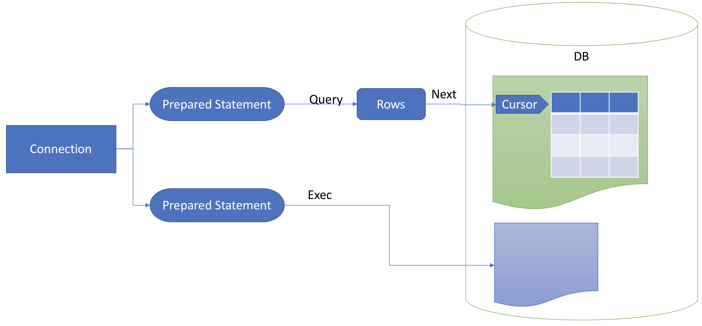

# Go Class 13 MySQL and Web

## MySQL

與 Java JDBC 類似，Go 有定義一套 interface，所有要連 DB 的 driver，都需要實作這個 interface。以下我是用 [go-sql-driver/mysql](https://github.com/go-sql-driver/mysql)

**Select** sample code:

```go
import (
    "database/sql"
    _ "github.com/go-sql-driver/mysql"
)

// Schedule ...
type Schedule struct {
    ID      int64
    URL     string
    Referer string
    Count   int64
    Start   string
    Current int64
    Success int64
    Failed  int64
    Status  int32
}


// Connect ...
func Connect(driver, uri string) (*sql.DB, error) {
    db, err := sql.Open(driver, uri)
    if err != nil {
        return nil, err
    }

    if err := db.Ping(); err != nil {
        return nil, err
    }
    return db, nil
}

// RowScanSchedule ...
func RowScanSchedule(rows *sql.Rows) (*Schedule, error) {
    tmp := &Schedule{}
    if err := rows.Scan(&tmp.ID, &tmp.URL, &tmp.Referer, &tmp.Count, &tmp.Start, &tmp.Current, &tmp.Success, &tmp.Failed, &tmp.Status); err != nil {
        return nil, err
    }
    return tmp, nil
}

db, err := Connect("mysql", "crawler:1234@/crawler")

if err != nil {
    // ...
    return
}

defer db.Close()

sel, err := db.Prepare("select id, url, referer, count, start, current, success, failed, status from schedule where status = ? order by start desc")

if err != nil {
    // ...
    return
}
defer sel.Close()

rows, err := sel.Query(1)
if err != nil {
    // ...
    return
}
defer rows.Close()

for rows.Next() {
    tmp, err := RowScanSchedule(rows)
    if err != nil {
        // ...
        return
    }
    // ...
}
```

說明：

1. import package.

    ```go
    import (
        "database/sql"
        _ "github.com/go-sql-driver/mysql"
    )
    ```

    - `"database/sql"` 是 go 定義 sql interface 的 package
    - `_ "github.com/go-sql-driver/mysql"` mysql driver package

1. 定義資料的 struct，類似要做 ORM 的動作，當然也可以不要這個定義，都用變數來存資料。

    ```go
    // Schedule ...
    type Schedule struct {
        // ...
    }
    ```

1. 連線資料庫

    ```go
    func Connect(driver, uri string) (*sql.DB, error) {
        db, err := sql.Open(driver, uri)
        if err != nil {
            return nil, err
        }

        if err := db.Ping(); err != nil {
            return nil, err
        }
        return db, nil
    }

    db, err := Connect("mysql", "crawler:1234@/crawler")

    if err != nil {
        // ...
        return
    }

    defer db.Close()
    ```

    與 JDBC 連線類似，會傳入一組類似 url 的設定, 格式是：`[username[:password]@][protocol[(address)]]/dbname[?param1=value1&...&paramN=valueN]`。詳細的說明，請見：[DSN (Data Source Name)](https://github.com/go-sql-driver/mysql#dsn-data-source-name)。我在連線後，多做了 Ping 的動作，如下：

    ```go
    if err := db.Ping(); err != nil {
        return nil, err
    }
    ```

    記得取的 db 連線後，立即下 `defer db.Close()`，確保程式在結束後，會關閉連線。

1. 下 SQL，與 Java 的 PreparedStatement 類似。

    ```go
    sel, err := db.Prepare("select id, url, referer, count, start, current, success, failed, status from schedule where status = ? order by start desc")

    if err != nil {
        // ...
        return
    }
    defer sel.Close()
    ```

    與上述 db 類似，取得連線後，記得下 `defer sel.Close()` 確保程式結束後，會關閉 statement 連線。

1. 透過 Stmt 取得資料。

    ```go
    rows, err := sel.Query(1)
    if err != nil {
        // ...
        return
    }
    defer rows.Close()

    for rows.Next() {
        tmp, err := RowScanSchedule(rows)
        if err != nil {
            // ...
            return
        }
        // ...
    }
    ```

    - 使用 Stmt.Query 方式，取得 Rows

        ```go
        rows, err := sel.Query(1)
        if err != nil {
            // ...
            return
        }
        defer rows.Close()
        ```

        與上述取得連線一樣，立即下 `defer rows.Close()` 確保程式結束後，會關閉 rows。(說明文件說，會[自動關閉](https://golang.org/pkg/database/sql/#Rows.Close)。這部分就看自己的習慣了。但 DB 與 Stmt 一定要記得關。)

    - 跟 JDBC 一樣，一定要先執行 **Next** 才能取資料。

        ```go
        for rows.Next() {
            tmp, err := RowScanSchedule(rows)
            if err != nil {
                // ...
                return
            }
            // ...
        }
        ```

    - 透過 Rows.Scan 取得資料。

        ```go
        func RowScanSchedule(rows *sql.Rows) (*Schedule, error) {
            tmp := &Schedule{}
            if err := rows.Scan(&tmp.ID, &tmp.URL, &tmp.Referer, &tmp.Count, &tmp.Start, &tmp.Current, &tmp.Success, &tmp.Failed, &tmp.Status); err != nil {
                return nil, err
            }
            return tmp, nil
        }
        ```

**Insert** sample code:

```go
db, err := Connect("mysql", "crawler:1234@/crawler")
if err != nil {
    fmt.Fprintln(w, err)
    return
}
defer db.Close()

ins, err := db.Prepare("insert into schedule (url, referer, count, start) values(?,?,?,?)")
if err != nil {
    // ...
    return
}
defer ins.Close()

result, err := ins.Exec(url, referer, count, date+" "+time)
if err != nil {
    fmt.Fprintln(w, err)
    return
}

lastID, err := result.LastInsertId()
if err != nil {
    // ...
    return
}
```

說明：

1. 前半與上述 Select 相同都需要 import 及連線資料庫，記得下 `defer db.Close()`
1. 利用 DB.Pepare 建立一個 PreparedStatement 連線，記得下 `defer ins.Close()`
1. 與 Select 不同，使用 Stmt.Exec 執行指 SQL 指令。

    ```go {.line-numbers}
    result, err := ins.Exec(url, referer, count, date+" "+time)
    if err != nil {
        fmt.Fprintln(w, err)
        return
    }

    lastID, err := result.LastInsertId()
    if err != nil {
        // ...
        return
    }
    ```

    Result 功能：

    - LastInsertId(): 取得 **auto_increment** 的 id
    - RowsAffected(): 取得異動的資料筆數，注意，[文件](https://golang.org/pkg/database/sql/#Result)上說並非所有的 driver 都會實作。

**Update/Delete** 與 Insert 類似。

### Connect, Prepared Statement, Rows, Cursor 關係



## Web

Go 有內建撰寫 Web Server 的套件，可以自己實作一套 AP server。因為 web 還會用到版型與靜態資料，因此在專案目錄的配置建議如下：

```text
web
├── db.go
├── index.go
├── main.go
├── public
│   └── db.png
└── templates
    ├── add.html
    ├── added.html
    ├── index.html
    ├── layout.html
    └── nav.html
```

目錄說明

- public: 放置靜態資料，實際運作上，AP server 可以不用處理靜態資料。
- templates: 放置版型

eg:

```go
package main

import (
    "fmt"
    "html/template"
    "log"
    "net/http"
)

func main() {
    mux := http.NewServeMux()
    files := http.FileServer(http.Dir("./public"))

    mux.Handle("/static/", http.StripPrefix("/static/", files))

    mux.HandleFunc("/add", add)
    mux.HandleFunc("/", index)

    server := &http.Server{
        Addr:    "0.0.0.0:8080",
        Handler: mux,
    }

    err := server.ListenAndServe()
    if err != nil {
        log.Fatalln(err)
    }
}
```

程式說明:

1. import 必要的 package

    ```go
    import (
        // ...
        "html/template"
        "net/http"
    )
    ```

    - `"html/template"`: Go 的 template engine。可以直接修改版型，不用重啟系統。
    - `"net/http"`: Http 模組

1. 實作 routing 機制：

    ```go
    mux := http.NewServeMux()
    files := http.FileServer(http.Dir("./public"))

    mux.Handle("/static/", http.StripPrefix("/static/", files))

    mux.HandleFunc("/add", add)
    mux.HandleFunc("/", index)
    ```

    - http.NewServMux(): 產生 `ServMux` 物件，用來處理 url routing 的工作。
    - 處理靜態資料:

        ```go
        files := http.FileServer(http.Dir("./public"))
        mux.Handle("/static/", http.StripPrefix("/static/", files))
        ```

        - 指定檔案放的目錄：`http.FileServer(http.Dir("./public"))`
        - 設定 靜態資料的 url，指到剛剛設定的 `FileServer`。

1. 其他 URL 的 routing: 利用 `HandleFunc` 來設定 URL 與處理 function 的關係。以下的 sample，`/add` 會執行 `add`, `/` 會執行 `index`

    ```go
    mux.HandleFunc("/add", add)
    mux.HandleFunc("/", index)
    ```

1. 綁定 port 並啟動 web server

    ```go
    server := &http.Server{
        Addr:    "0.0.0.0:8080",
        Handler: mux,
    }

    err := server.ListenAndServe()
    if err != nil {
        log.Fatalln(err)
    }
    ```

### Handler 與 Request Parameter

Handler function 的定義：

```go
func name(w http.ResponseWriter, r *http.Request) {
    body
}
```

eg:

```go
func add(w http.ResponseWriter, r *http.Request) {

    // ...
    if r.Method == "GET" {
        generateHTML(w, data, "layout", "nav", "add")
    } else if r.Method == "POST" {
        // ...
        url := r.PostFormValue("myurl")
        if !strings.HasPrefix(url, "http") {
            url = "http://" + url
        }

        generateHTML(w, data, "layout", "nav", "added")

    }
}
```

1. 可透過 `r.Method` 來判斷是 GET or POST 等
1. 透過 `r.PostFormValue` 來取得 POST 值。Go 有內建多種取 request 值的方式，整理如下：

| Field | Should call method first | parameters in URL | Form | URL encoded | Multipart (upload file)
| - | - | - | - | - | -
| Form | ParseForm | ✓ | ✓ | ✓ | -
| PostForm | Form | - | ✓ | ✓ | -
| MultipartForm | ParseMultipartForm | - | ✓ | - | ✓ |
| FormValue | NA | ✓ | ✓ | ✓ | -
| PostFormValue | NA | - | ✓ | ✓ | -

from: [Go Web Programming](https://www.manning.com/books/go-web-programming)

### Templates

// TO-DO

eg:

```go
func generateHTML(w http.ResponseWriter, data interface{}, files ...string) {
    var tmp []string
    for _, f := range files {
        tmp = append(tmp, fmt.Sprintf("templates/%s.html", f))
    }

    tmpl := template.Must(template.ParseFiles(tmp...))
    tmpl.ExecuteTemplate(w, "layout", data)
}
```