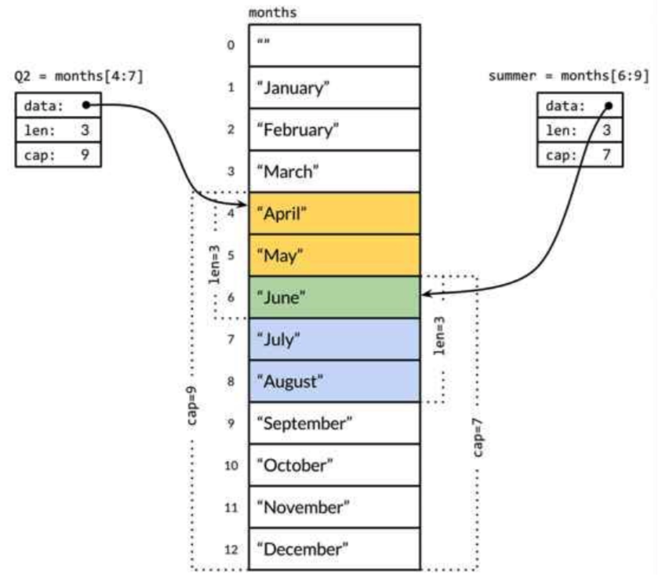

# H1

## H2

### H3

**Bold**

*Itlic*

~~Del~~

[pchome](http://www.pchome.com.tw)


- A
  - D
    - E
- B
- C

1. A
1. B

```go
import fmt

func main() {

}
```

```java
public class Test {
    public static void main(String[] args) {

    }
}
```

```php
$a = 10;
```

你要執行 `ls -la`。


| Left Aligned  | Center Aligned  | Right Aligned |
|:------------- |:---------------:| -------------:|
| col 3 is      | some wordy text |         $1600 |
| col 2 is      | centered        |           $12 |
| zebra stripes | are neat        |            $1 |

30^th^

_123_

*[HTML]: Hyper Text Markup Language
*[W3C]:  World Wide Web Consortium
The HTML specification
is maintained by the W3C.

__a b__

